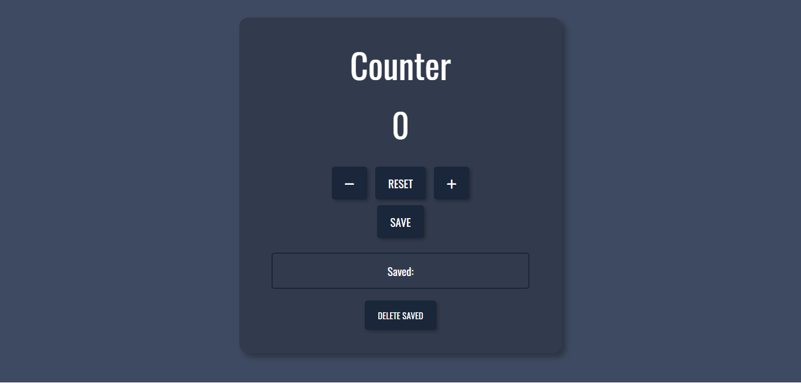
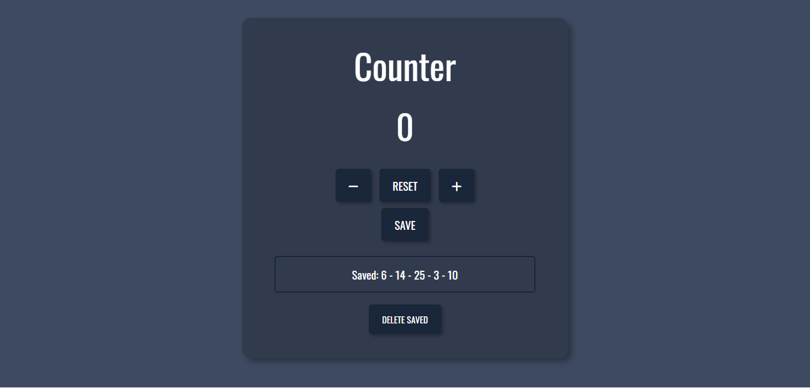

# JavaScript Counter

This is the final project from the JavaScript basics course on the online course provider [Start2Impact](https://www.start2impact.it/), where I'm studying front-end development.

## Link

- [Project url](https://counterwebsite.netlify.app/) (hosted on Netlify)

## Screenshots

## Project

Users should be able to:

- Increase and decrease the counter by clicking or tapping on the + and - buttons
- Reset the counter by clicking or tapping on the reset button
- Save the current number on the counter by clicking or tapping on the save button
- See the saved numbers below the save button
- Delete the saved numbers by clicking or tapping on the delete button

## Built with

- Semantic HTML5 markup
- CSS custom properties and media queries
- JavaScript

## Author

Chiara Stefanelli - Front-End Development Student based in Italy

- Website - [Chiara Stefanelli](https://chiarastefanelli.netlify.app/)
- LinkedIn - [Chiara Stefanelli](https://www.linkedin.com/in/chiarastefanelli/?locale=en_US)
- start2impact profile - [Chiara Stefanelli](https://talent.start2impact.it/profile/chiara-stefanelli-13)
